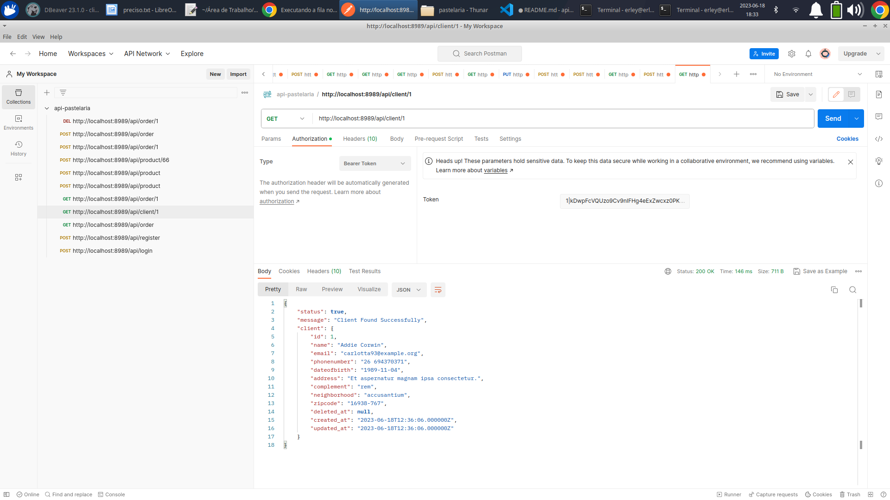

Instale o Docker e Docker Compose

Entre na pasta do projeto

Suba os containers do projeto
```sh
docker-compose up -d
```
Acesse o container
```sh
docker-compose exec app bash
```

Instale as dependências do projeto
```sh
composer install
```

Gere a key do projeto Laravel
```sh
php artisan key:generate
```

copie o arquivo .env.example e prencha os campos

```sh
DB_CONNECTION=mysql
DB_HOST=db
DB_PORT=3306
DB_DATABASE=laravel
DB_USERNAME=root
DB_PASSWORD=root

MAIL_MAILER=smtp
usei o mail trap no teste mas você pode usar qualquer serviço de e-mail
MAIL_HOST=sandbox.smtp.mailtrap.io 
MAIL_PORT=2525
MAIL_USERNAME=seu usuario
MAIL_PASSWORD=sua senha
MAIL_ENCRYPTION=tls
MAIL_FROM_ADDRESS="seu email"

REDIS_HOST=127.0.0.1
REDIS_PASSWORD=null
REDIS_PORT=6379

```

crie um env.testing com as mesmas informações acima, só mude o campo DB_DATABASE=laravel para DB_DATABASE=laraveltestes

Acesse o mysql na porta localhost:3388 com o usuario e senha do .env
Crie o database laravel e o database laraveltestes

Acesse o container
```sh
docker-compose exec app bash
```

Rode os comandos abaixo para gerar as tabelas e o dados:

```sh
php artisan make migration
php artisan sb:seed
```

Rode 
```sh
php artisan jwt:secret
php artisan jwt:secret --env=testing
'''

Antes do teste inicie a fila

```sh
php artisan queue:work --tries 3
```


A api está acessivel na porta http://localhost:8989

Faça o registro de um usuário para acesso a api na rota 

POST http://localhost:8989/api/register

com as seguintes informações 

```sh
{
    "name":"seu nome",
    "email":"seu email",
    "password":"sua senha"
}
```

Depois faça o login na rota

POST http://localhost:8989/api/login

```sh
{
    "email":"seu e-mail",
    "password":"sua senha",
    "device_name":"pc"
}
```

Vai ser gerado um token para ser utilizado nas rotas autenticadas

Adicione o token para o authorization do tipo bearer token

Segue o exemplo no postman



Documentação da api em:
http://localhost:8989/swagger/index.html

ou pelo postman com o json api-pastelaria.postman_collection.json na raiz